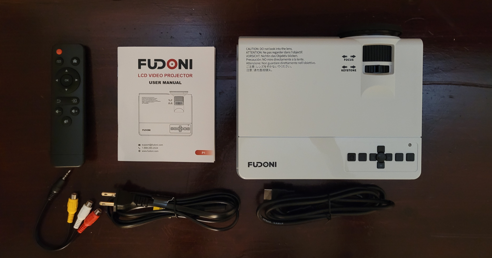
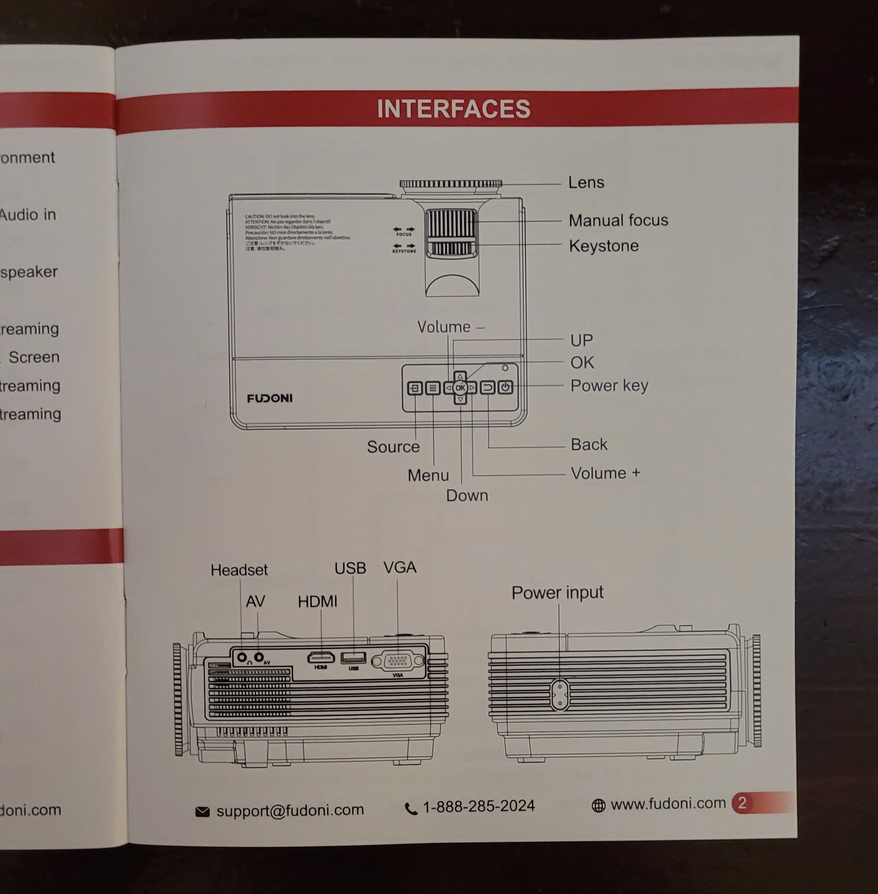
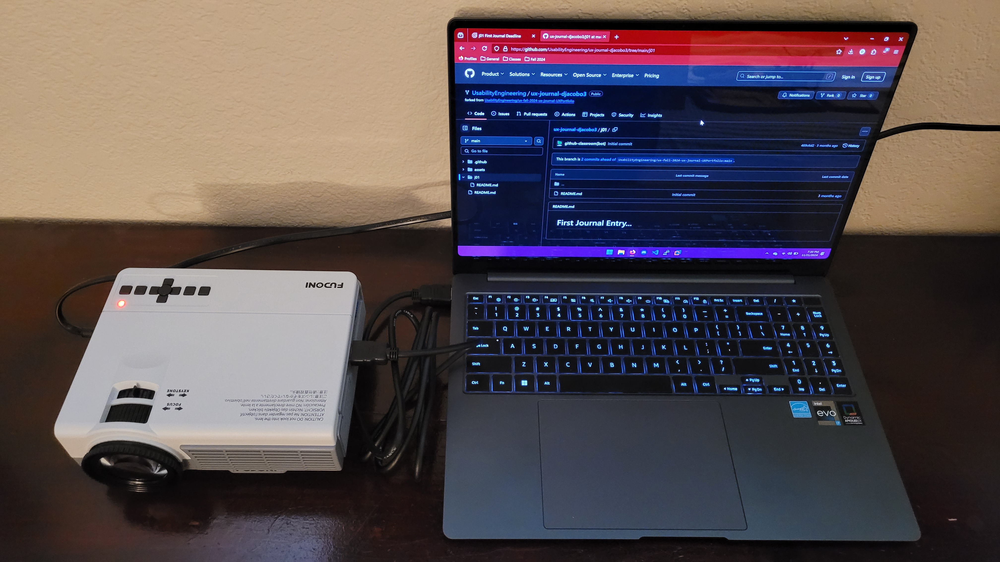
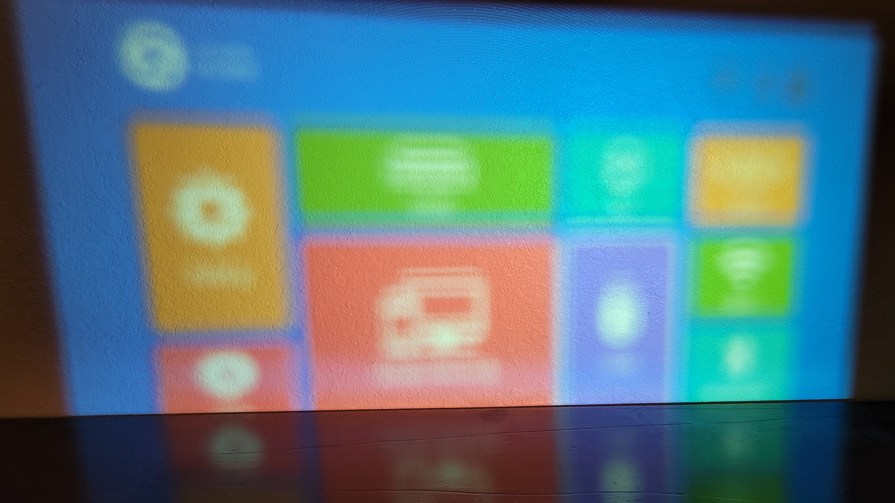
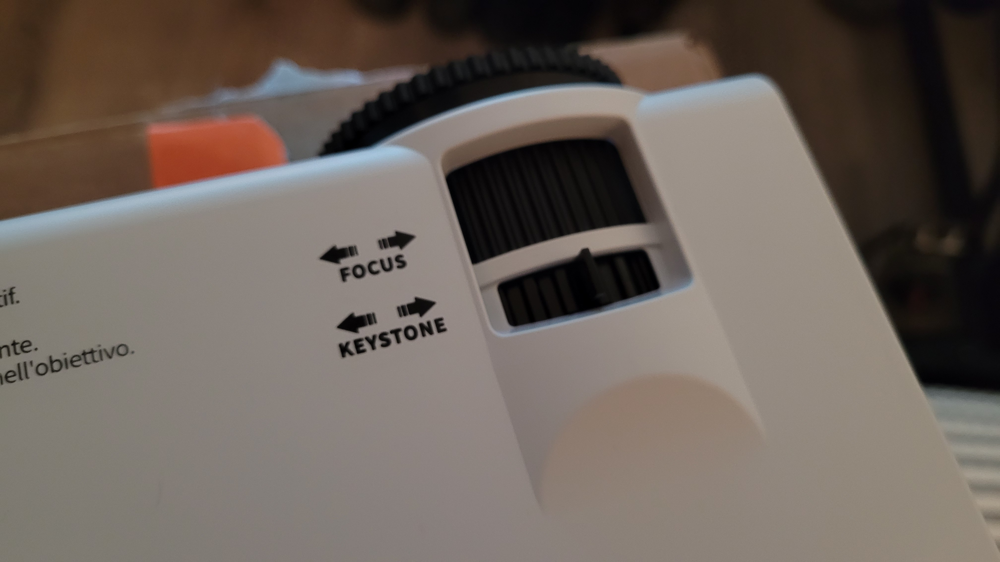
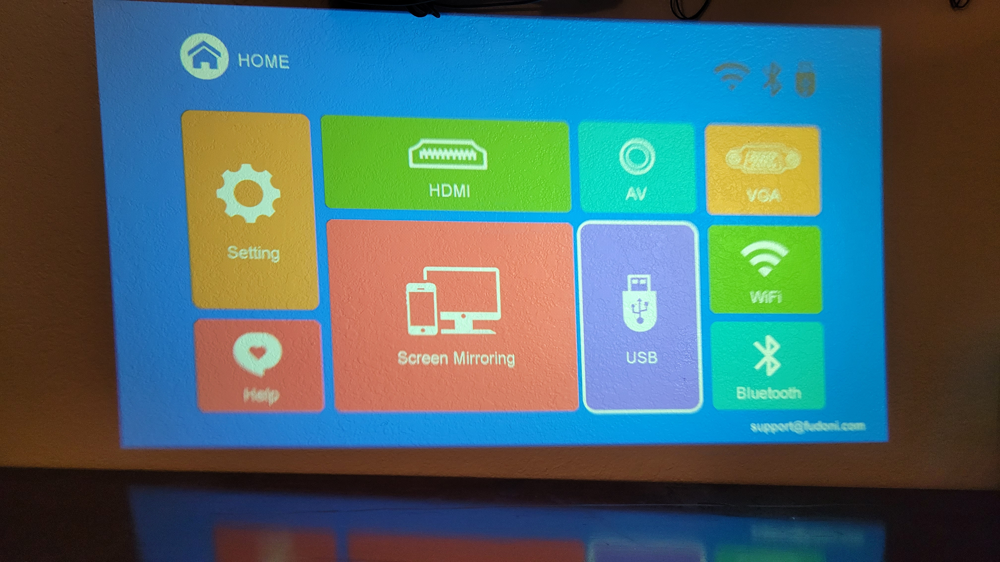
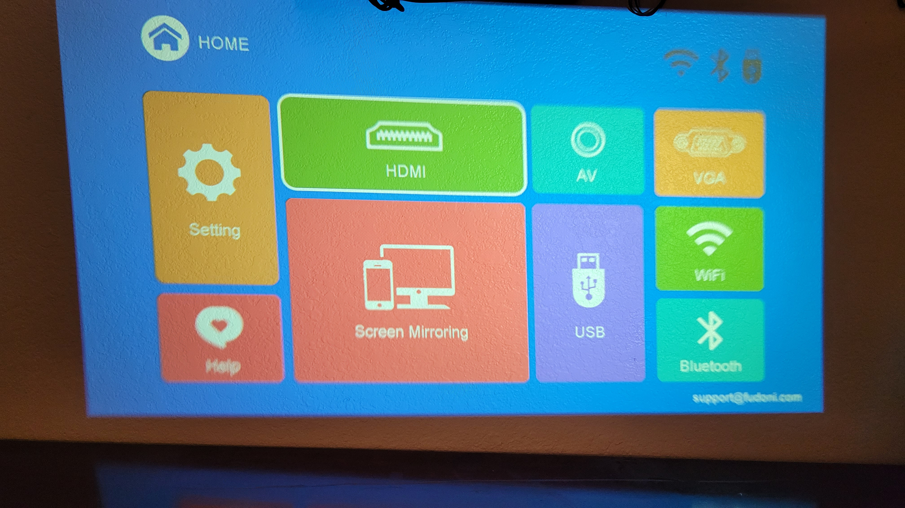
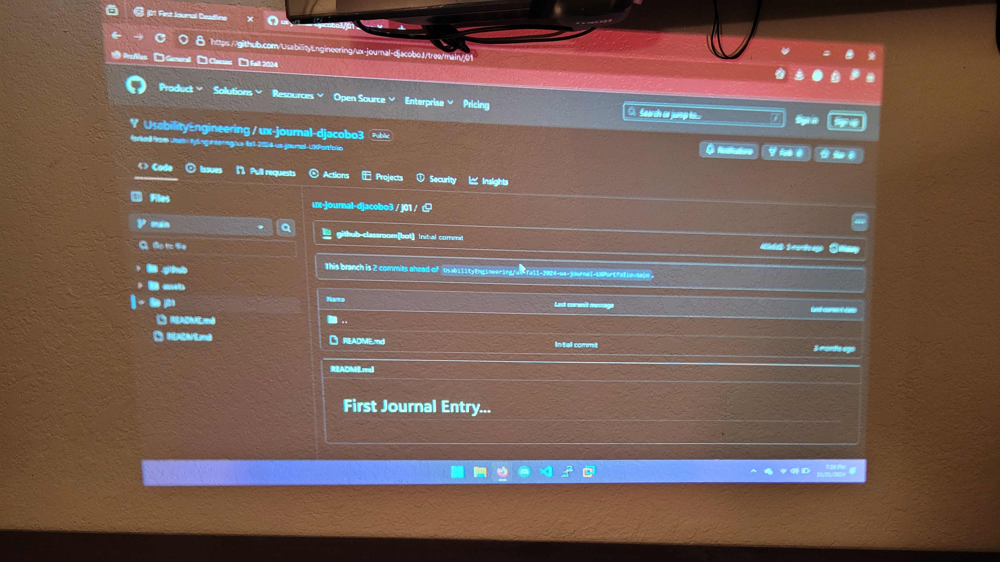

# Just like a TV!
### By David Jacobo, 11/22/24

Recently, my parents purchased the FUDONI LCD Video Projector to use on upcoming trips. To ensure that this specific device would work as expected, I attempted to set up the projector so that it could output a laptop screen.
Here are the main components of the kit.

Out of all these items, all I needed were the remote, manual, power cable, HDMI cable, and the projector itself. When I looked at the projector, I noticed that there were many interfaces, but they were organized in a convenient way. The power cable could be attached on one side, and any inputs/outputs on the other. This can be seen clearly from the manual visual.

After attaching the two cables, I was ready to turn on the device.

With the remote control in hand, I instinctively pressed the red button at the top which is typically the power button. In fact, for the remainder of the setup, I found myself using this remote as if it were for a modern TV (*home button, directional arrows around the OK, back arrow for return, and volume controls*). This goes to show how **consistent** this device is with **standards** for other broadcasting devices that are designed to be used in daily life by people of all ages.

After loading for a few seconds, the projector settled on the above menu screen. The immediate issue was the blurriness of the output video. Looking back at the lens area, two components stood out to me: *FOCUS* and *KEYSTONE*.

Focus already has a strong correlation with correcting images, especially when thinking of digital cameras. The image can be corrected from any blurriness by turning the ring around the lens. By applying that same idea to this projector and fidgeting with the rotation, it took short work to get a much sharper output.

As mentioned before, my goal was to make the projector output my laptop screen via HDMI. Using the remote, I simply navigated to the appropriate menu item. It’s worth noting that this menu is excellent on a usability level as it follows the rule of **“Aesthetic and Minimalist Design.”** This means that any visuals or interfaces should focus on the essentials that would be important for common goals. In this case, there are only a few options and they are all available on one screen with recognizable icons.

It only took a few seconds after pressing *OK* for my screen to pop up without any issues.

Overall, the experience was basically seamless. All of my approaches flowed together as if my own **mental model** of the setup process was accurate to the **conceptual model**, or how the projector actually works. I’m confident that its simplicity and flexibility with other input methods will provide a comfortable and **satisfying** experience for others who are interested in a projector.
